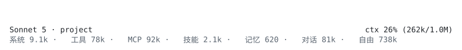

# claude-code-context-bar

**v0.1.0**

给 Claude Code 的 statusline 加一条和dsh-tui同款的上下文用量条 —— 色带 + 按类别拆分的用量明细。
（因为CC的statusline没有鼠标事件，所以没有了hover时显示详细信息的效果）



- **三行输出**：ctx用量+色带（各段按 token 占比分列）、模型与项目名、分段明细
- **数据来自 Claude Code 本身**：`context_window` 是官方字段，不是估算
- **固定开销精确读取**：从 transcript 的 `prompt_snapshot` 里读系统提示词和工具定义原文
- **零依赖**：只用 Node 内置模块
- **卸载可逐字节还原**：用字符串增删而非 JSON 重序列化，不打乱你的键顺序和缩进

色带的分段（由深到浅）：**系统提示词 → 内置工具 → MCP 工具 → 技能 → 记忆 → 对话**，最后是自由段，右侧压着用量读数。第三行的彩色小方块与色带一一对应。

## 安装

需要 Node.js 18+ 和 Claude Code。

```bash
git clone https://github.com/Ansau-Inv/claude-code-context-bar
cd claude-code-context-bar
node install.mjs
```

然后重启 Claude Code。

安装脚本只做两件事：把 `context-bar.mjs` 复制到 `~/.claude/statusline-context-bar/`，往 `~/.claude/settings.json` 加一个 `statusLine` 键。

## 卸载

```bash
node install.mjs --uninstall
```

移除 `statusLine` 键并删除脚本目录。`settings.json` 会还原成安装前的样子。

## 配置

用 `--margin` 控制右侧留白。命令写在 `~/.claude/settings.json` 的 `statusLine.command` 里：

```json
{
  "statusLine": {
    "type": "command",
    "command": "node ~/.claude/statusline-context-bar/context-bar.mjs --margin 4"
  }
}
```

| 参数 | 说明 |
| --- | --- |
| `--margin N` | 右侧留白列数，默认 4。**条比输入框宽、右侧被截断就调大** |
| `--no-breakdown` | 不输出第三行分段明细 |
| `--lang en` | 明细标签用英文（默认 `zh`） |
| `--no-color` | 等价于环境变量 `NO_COLOR=1` |
| `--version` | 打印版本号 |

### 让宽度实时跟随窗口

Claude Code 不会因为终端尺寸变化就重跑 statusline，拉窄窗口后条会短暂停留旧宽度。加 `refreshInterval` 让它定时重跑：

```json
{
  "statusLine": {
    "type": "command",
    "command": "node ~/.claude/statusline-context-bar/context-bar.mjs --margin 4",
    "refreshInterval": 1
  }
}
```

每次约 100ms（大部分是 shell 启动开销）。嫌重就调大这个值。

## 分段是怎么算的

Claude Code 传进来的只有总量（`context_window.total_input_tokens`），不提供分类。分类来自 transcript：

| 段 | 来源 |
| --- | --- |
| 系统 | `prompt_snapshot.systemPrompt` + `cliPrefix` |
| 工具 | `prompt_snapshot.tools` 里非 `mcp__` 前缀的 |
| MCP | `prompt_snapshot.tools` 里 `mcp__` 前缀的 |
| 技能 | `skill_listing` 附件 |
| 记忆 | `instructions` 附件 |
| 对话 | **总量减去以上各项**，所以总量永远精确，`/compact` 后自动收缩 |

字符转 token 的系数（ASCII 3.05、CJK 1.0）是对着 `/context` 面板校准的。系统提示词和 JSON schema 标点密集，比英文散文（约 4 字符/token）更费 token —— 用 4 会低估约 30%。

实测与 `/context` 面板的吻合度：

| | `/context` | 本工具 |
| --- | --- | --- |
| System prompt | 9.1k | 9.1k |
| Skills | 2.2k | 2.1k |
| 工具类合计 | 167.8k | 170k |

绝对值和官方有差异（官方有自己的计数口径），但**占比关系是准的**，而这正是色带要表达的。

## 缓存命中率为什么有时不显示

`prompt_cache.hit_ratio` 只在网关真的上报缓存时才有意义。如果你的中转（企业网关、第三方代理）不上报，Claude Code 会给出 `caching_observed: false` 且 `hit_ratio` 恒为 0 —— 这种情况下本工具**隐藏该字段**，因为显示 `0.0%` 是把「没有数据」误报成「命中率是零」。

## 兼容性

- 跨平台：Windows / macOS / Linux
- Windows 上 Claude Code 经由 Git Bash 执行命令，所以命令里的路径用正斜杠
- 输出宽度读 `COLUMNS` 环境变量（statusline 的 stdout 被捕获，读不到终端尺寸）
- 中文字符按 2 列计算，East-Asian ambiguous 字符（`·`、`█`）按 1 列

## 已知限制

- **宽度不会瞬间跟随**：Claude Code 只在特定事件重跑 statusline，终端尺寸变化不在其中。用 `refreshInterval` 缓解。
- **首次运行稍慢**：要读一次 transcript（最大 64MB）。之后按 `mtime + size` 缓存，只做一次 `stat`。缓存在系统临时目录，按 transcript 路径隔离。
- **固定开销是估算**：段落划分精确，token 数是按字符数换算的。

## 开发

`docs/preview.svg` 由脚本的真实输出生成，不是手绘的，所以图和实现不会脱节：

```bash
node docs/make-preview.cjs ./context-bar.mjs <transcript.jsonl> docs/preview.svg
```

传一个真实的 transcript 路径即可（`~/.claude/projects/<项目>/<会话>.jsonl`）。改动渲染逻辑后重新生成一次，图就跟着更新。

脚本本身没有依赖，也不需要构建。手动预览：

```bash
node context-bar.mjs
```

（stdin 是 TTY 时用内置示例数据渲染，不会阻塞等输入。）

## 许可

MIT
